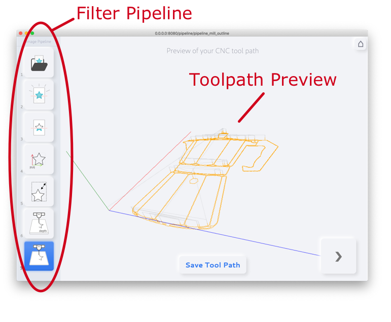

# Basic Principal of the Software

The basic idea of the software is to use a **filter pipeline** to convert and modify the source image to produce 
 [GCode](https://en.wikipedia.org/wiki/G-code) output. The filter pipeline uses filters to transform the data in discrete steps along the dataflow path.

## Pipelines
Filters are arranged and called in a specific order to create a data flow, called a pipeline. 
Each filter takes a single action. For example, the Blur Filter takes an incoming video frame, applies a blur action to the frame data and then passes the new frame data to the next filter in the path.

The order of the filters matches the order in which they appear in the left-hand side of the window. Each filters effects is immediately visible in the preview video feed and can have some slider to adjust basic filter parameter.

## Output
After processing and converting the input image into vector data, the data is taken and converted to GCODE.  

CNC machines like routers or milling machines make use of a series of pre-programmed commands to, in subtractive processes, take material from your piece. The most popular programming language is G-Code, the creation of which marked an important step in the history of CAM. This language controls exactly how your CNC machine’s tools move. From how fast your tools move to the speed of rotation, everything is covered in the G-Code. 

The generated GCode of this software can either send direct to your CNC machine which runs grbl or you can use bCNC as an host to connect to your machine.